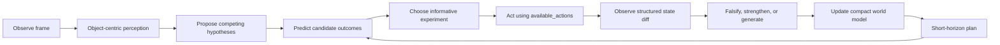

# HypothesisWorld — Can an agent learn an unknown world by doing science?

HypothesisWorld is an open-source ARC-AGI-3 research agent built on the official
[Kaggle Starter](https://github.com/arcprize/ARC-AGI-3-Kaggle-Starter) and compatible
with the official [Agents framework](https://github.com/arcprize/ARC-AGI-3-Agents).
It studies whether an agent can solve unfamiliar interactive environments by keeping
competing explanations, choosing experiments that separate them, falsifying failed
explanations, and planning with the world model that survives.

It is deliberately not a game-ID lookup table, a random policy presented as research,
or an online LLM wrapper. The submission is deterministic, lightweight, and fully
offline.

## Scientific loop



Every action is selected from the current frame's `available_actions`. Coordinate
actions use object centroids, bounding-box corners, recent change regions, object
boundaries, and deterministic coverage points—not uniform random clicks.

## Architecture

| Module | Responsibility |
|---|---|
| `agent/perception.py` | Animation-frame normalization, background inference, connected objects, matching, motion, transformations, changes, and contacts |
| `agent/state.py` | Immutable object-centric state, raw audit identity, abstract learning identity, and state-diff schema |
| `agent/hypotheses.py` | Competing predictions, beliefs, support, contradictions, complexity, rejection, and hypothesis generation |
| `agent/exploration.py` | Legal action candidates, salient coordinates, novelty, risk, and prediction-disagreement scoring |
| `agent/world_model.py` | Online empirical state/action transition model with uncertainty |
| `agent/memory.py` | Bounded transitions, visited states, tested actions, object persistence, rejected rules, progress, deaths, and wins |
| `agent/planner.py` | Transition- and representation-confidence-gated short-horizon action values |
| `agent/my_agent.py` | Official `Agent` interface adapter, lifecycle handling, and readable instrumentation |
| `agent/config.py` | One-codepath ablation configuration |

The architecture re-plans after each observation. Exploration remains active whenever
the model is uncertain or competing predictions disagree.

## Ablations

Set `HYPOTHESISWORLD_ABLATION` to:

| Value | Variant |
|---|---|
| `A` | Random legal-action baseline; coordinates still remain valid |
| `B` | Novelty and action-statistics exploration |
| `C` | Empirical world model without explicit hypotheses |
| `D` | Explicit hypotheses without information-gain selection |
| `E` | Hypotheses plus prediction-disagreement experiments |
| `F` | Full system: hypotheses, active experiments, memory, world model, and planning |

Run a controlled sweep with:

```bash
.venv/bin/python experiments/run_ablations.py --games ls20,vc33 --steps 100 --seeds 0,1,2
```

The state representation keeps a full-frame fingerprint for auditing and an
object-centric fingerprint for learning. Border-connected components are treated as
possible interface noise in the learning key but remain visible to perception and
action generation. Raw-to-abstract alias counts reduce planning confidence when that
assumption merges too many distinct screens.

The first controlled pilot and its limitations are recorded in
[`experiments/reports/2026-09-15-stable-state-pilot.md`](experiments/reports/2026-09-15-stable-state-pilot.md).

## Setup and verification

Python 3.12 is required. The starter's original workflow remains intact:

```bash
make setup
make test
make verify-local
make play-local GAME=ls20 STEPS=200
make notebook
```

`make submit` and `make status` retain the official Kaggle workflow. Before submitting,
put your token in `.kaggle/access_token`, accept the competition rules, and replace
`REPLACE_WITH_YOUR_USERNAME` in `notebooks/kernel-metadata.json`.

`make notebook` embeds every Python file in `agent/` into the generated notebook and
copies the package into the Kaggle framework at runtime. It installs only wheels from
the competition dataset and makes no internet calls during evaluation.

## Instrumentation

Each step emits two structured `HYPOTHESISWORLD` log records:

- `selection`: compact state, top beliefs, candidate predictions, information,
  novelty, expected progress, risk, planning value, and selected experiment.
- `outcome`: actual structured transition plus strengthened, falsified, and newly
  generated hypotheses.

The same concise record is attached to `GameAction.reasoning`, so official recordings
retain the reason for each action.

## Research boundaries

Current hypotheses describe observable transition outcomes. They are genuine explicit,
falsifiable alternatives, but they do not yet induce relational programs or causal
latent-state machines. Likewise, the planner uses learned empirical transitions rather
than a full symbolic simulator. These limitations are the main research frontier, not
hidden behind claims of solved general intelligence. See [RESEARCH_PLAN.md](RESEARCH_PLAN.md).
